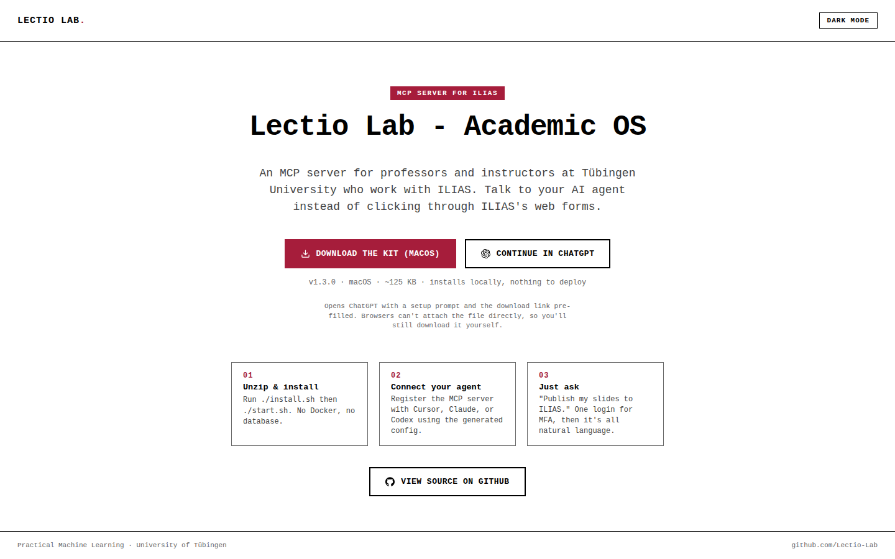

# Lectio Lab — Website

The official landing page for **Lectio Lab**, an MCP server that lets professors and instructors at the University of Tübingen publish course material and grades to ILIAS by talking to their AI agent instead of clicking through ILIAS's web forms.

**Live site:** https://lectio-lab.github.io/website.github.io/

## What's here

A single self-contained HTML page (light and dark mode, no build step) with a short pitch, a three-step "how it works," a direct download link for the macOS installer kit, a "Continue in ChatGPT" button that opens a prefilled setup prompt, and a link to the product's source code.

## Get the kit

Download the latest macOS build from [`downloads/`](downloads/), or grab it straight from the live site above.

## Source code

The actual product — the MCP server, the local service, and the agent skills this page promotes — lives in a separate repository:

**https://github.com/Lectio-Lab/ilias_portal**

## License

MIT — see [LICENSE](LICENSE).
